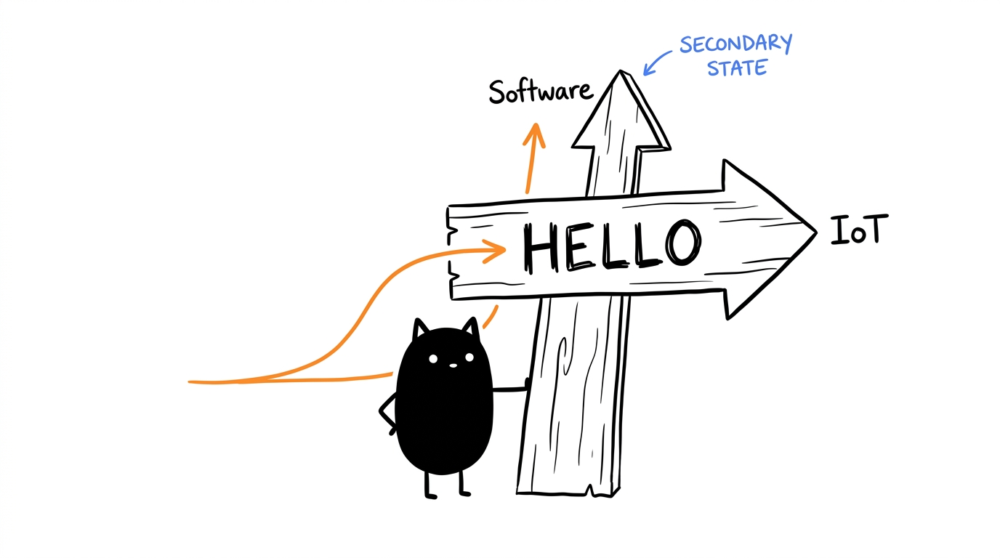
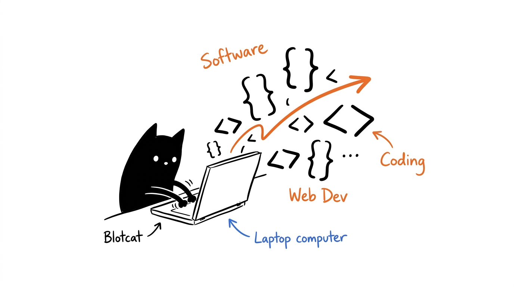
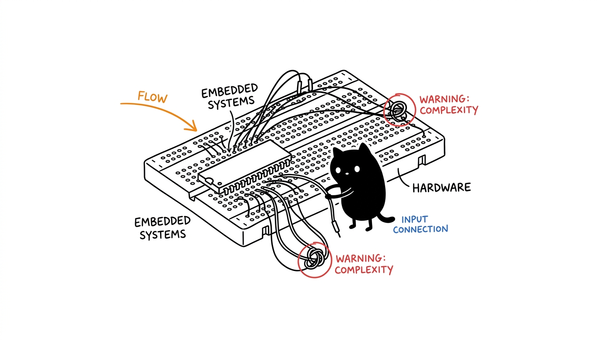

  
  
  <h1>Azzar Budiyanto</h1>
  
<b>Software Developer | IoT & Embedded Systems</b>

  
  
I build web applications and embedded hardware solutions. My current focus is developing cloud-native microservices and edge computing architectures.

  
  
  
  
   
   
  

---

## What I do

<table align="center" style="border: none;">
  <tr>
    <td width="50%" align="center" style="border: none;">
      
      <h3>Software Engineering</h3>
      
Building scalable backend services and responsive frontend applications using <b>React, Node.js, Express, and Django</b>.

    </td>
    <td width="50%" align="center" style="border: none;">
      
      <h3>Embedded Systems</h3>
      
Designing hardware integrations and edge computing solutions using <b>C/C++, Arduino, ESP32, and STM32</b>.

    </td>
  </tr>
</table>

## Technical Stack

- **Languages:** JavaScript, TypeScript, Python, C/C++
- **DevOps & Cloud:** Docker, Kubernetes, AWS, CI/CD
- **Currently Learning:** Distributed systems and advanced cloud-native architectures.

## GitHub Activity

  
  

  

---

  
Find me elsewhere:

  
  
  
  
  
   
   
  
   
   
  

